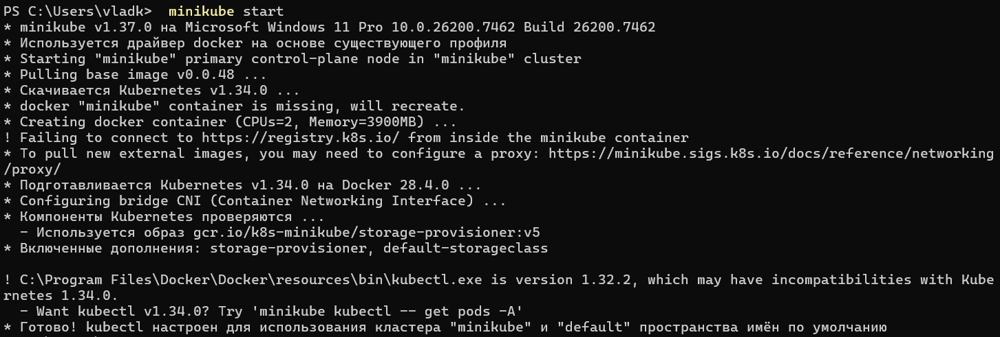
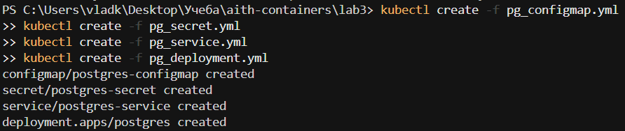
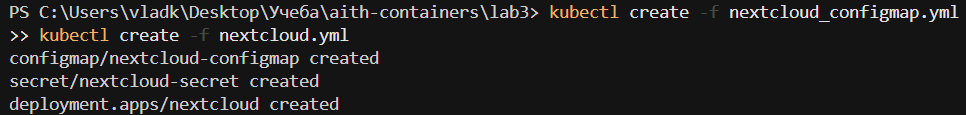
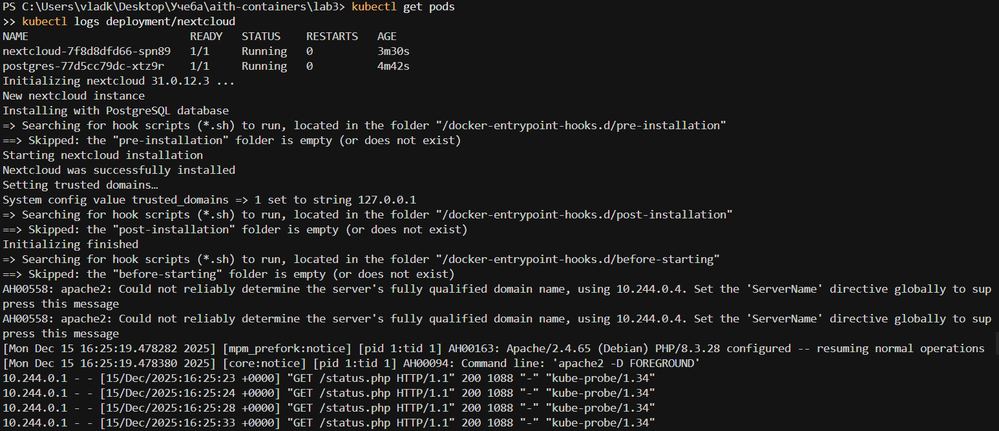
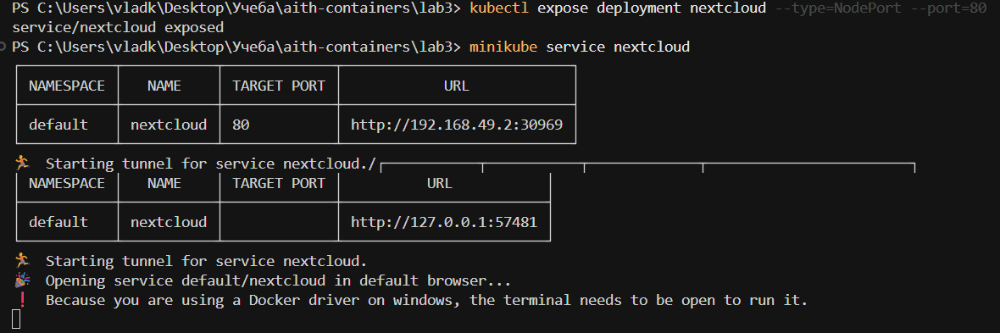
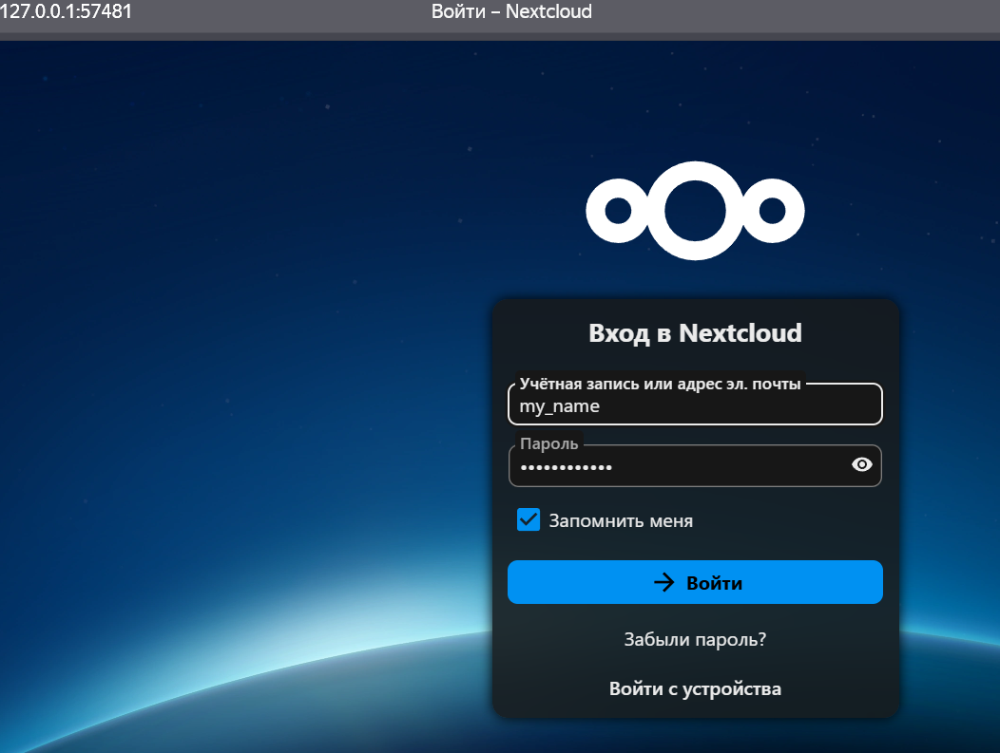

# Лабораторная работа №3

## Ход работы
1. Запуск minikube

2. Запуск манифестов для postgres

3. Запуск манифестов для nextcloud

4. Туннелирование трафика

5. Админка Nextcloud

## Ответы на вопросы

1. Да, как минимум я столкнулся с такими проблемами:
- configmap и secret должны быть созданы до deployment, потому что deployment ссылается на них через `valueFrom: configMapKeyRef` и `secretKeyRef`. Если их нет, то под не запустится и выдаст ошибку `CreateContainerConfigError`
- Service для postgres должен быть создан до nextcloud, чтобы имя `postgres-service` было доступно. Без него nextcloud не сможет подключиться к базе данных

2. Все данные из postgres удалятся, nextcloud перестанет работать и база с файлами пропадут, так как нет PersistentVolume. При пересоздании пода база будет пустая, и nextcloud не сможет подключиться

