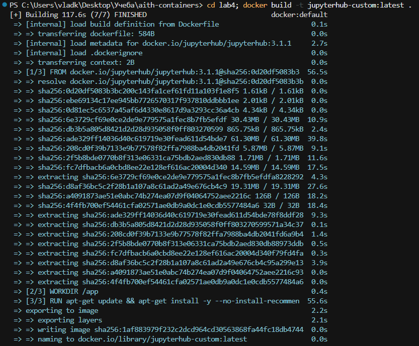
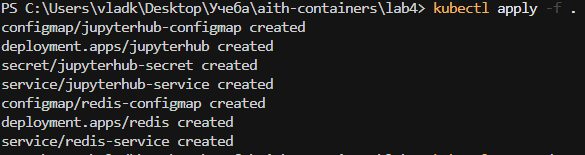
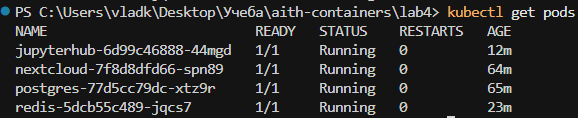
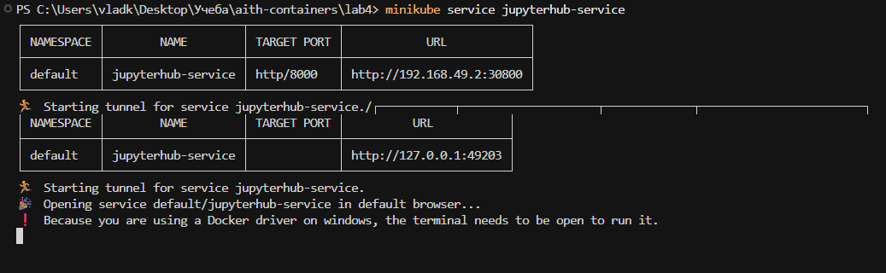
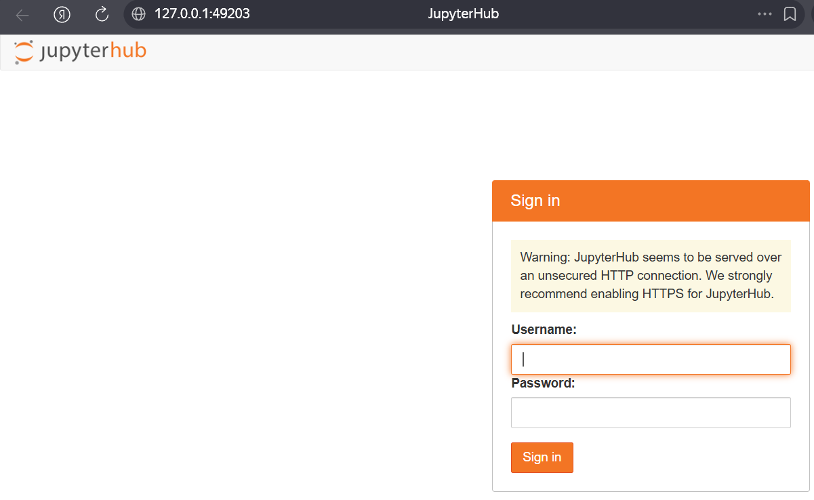

# Лабораторная работа №4

В этом дз развёрнут сервис jupyterhub с redis через minikube в Kubernetes

## Ход работы

1. Сборка кастомного образа

2. Применение манифестов

3. Проверка статуса

4. Доступ к сервису

5. UI jupyterhub

